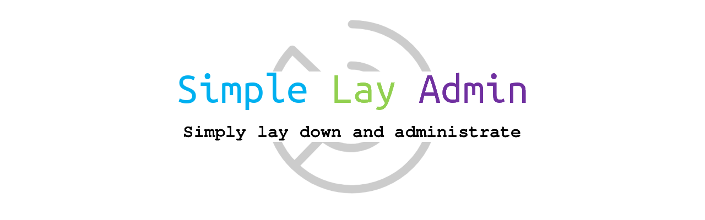

Based on Layui web UI component library, **Simple Lay Admin** is a theme template for web admin applications.
It simplifies the process by offering a fully functional iframe tabs framework (nothing more except a login page template at this point).

## How to View

1. Clone the project repo through git, or download it as a zip file and then decompress.
2. Navigate to the project root directory.
3. Open [`login.html`](login.html) or [`index.html`](index.html) in a modern web browser and it will be all good to go.
4. The template pages should be compitable with all common backend frameworks.

## How to Use

Any HTML element in [`index.html`](index.html) with an `<a>` tag and a `layui-href` class attribute will be used as the reference to open a new iframe tab or jump to an existing iframe tab.

Notice that the value of the referential iframe source URL should be set through the `data-href` attribute instead of the usual `href` attribute.

## Project Repo

- English version: [GitHub](https://github.com/op-amp/simple-lay-admin)
- 中文版本：[Gitee](https://gitee.com/gitiber/simple-lay-admin)
